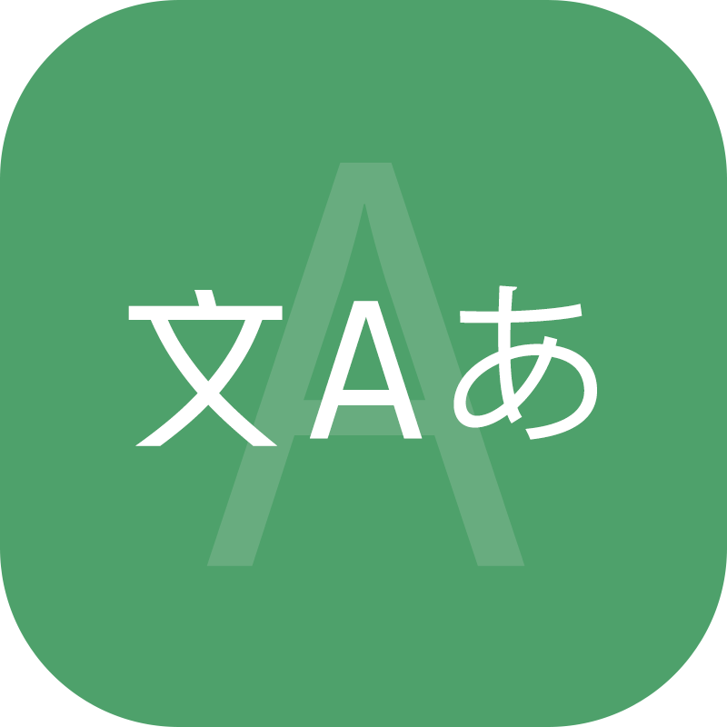
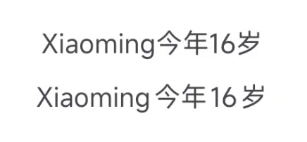
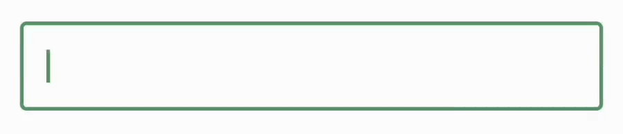

# Pangu Text

[](https://github.com/BetterAndroid/android-app-template/blob/main/LICENSE)
[](https://t.me/BetterAndroid)
[](https://t.me/HighCapable_Dev)
[](https://qm.qq.com/cgi-bin/qm/qr?k=Pnsc5RY6N2mBKFjOLPiYldbAbprAU3V7&jump_from=webapi&authKey=X5EsOVzLXt1dRunge8ryTxDRrh9/IiW1Pua75eDLh9RE3KXE+bwXIYF5cWri/9lf)



一个中日韩 (CJK) 与英文单词、半角数字排版的解决方案。

[English](README.md) | 简体中文

|  | [BetterAndroid](https://github.com/BetterAndroid) |
|---------------------------------------------------------------------------------------------------------------------------------|---------------------------------------------------|

这个项目属于上述组织，**点击上方链接关注这个组织**，发现更多好项目。

## 项目缘由

这个项目的起因是因为直到目前为止还没有一套公开的方案能够完美解决中文、日文、韩文与英文之间的排版问题，
正常情况下我们将 CJK (即中日韩) 与英文混排的时候，都会涉及到美观性问题，这算是一个历史遗留问题，全角文字与半角文字之间的书写规范不一样。虽然现在 W3C 规定了
CJK 排版规范，
但是还是仅有部分愿意遵守排版要求的个人或企业选择了这种方案。

目前已知的厂商解决方案如下

- Apple 全系 (iOS、iPadOS、macOS、tvOS、watchOS) 文本排版解决方案
- 小米 (HyperOS) 文本排版优化
- OrginOS 基于字体的文本排版优化

但是这些方案都是封闭的，无法在其他平台上使用，因此我们希望能够提供一套开源的解决方案，能够适应各种场景、侵入性低且更容易集成，让更多的开发者能够使用这个方案来解决文本排版问题。

本项目得以进行的主要来源为 [pangu.js](https://github.com/vinta/pangu.js)，它提供了一套 CJK 排版的正则，我们对其加以优化，实现各个平台不需要插入空格字符即可格式化文本排版的效果，
衷心感谢这个项目的开发者提供的方案，我们在这个方案上加以扩展，提供了更多解决方案的可能性。

## 效果

如你所见，`PanguText` 的排版方案并不是向 CJK 与英文单词之间插入空格来完成，而是使用每个平台对应的处理方案自动在这些字符之间添加空白间距来达到排版效果以达到最低的侵入性。

> 应用前 (上)、应用后 (下)



> 动态应用



`PanguText` 支持动态应用，它允许你在输入文本的同时动态为每个字符添加空白间距。

## 开始使用

[点击这里](https://betterandroid.github.io/PanguText/zh-cn) 前往文档页面查看更多详细教程和内容。

## 项目推广

<!--suppress HtmlDeprecatedAttribute -->
<div align="center">
    <h2>嘿，还请君留步！👋</h2>
    <h3>这里有 Android 开发工具、UI 设计、Gradle 插件、Xposed 模块和实用软件等相关项目。</h3>
    <h3>如果下方的项目能为你提供帮助，不妨为我点个 star 吧！</h3>
    <h3>所有项目免费、开源，遵循对应开源许可协议。</h3>
    <h1><a href="https://github.com/fankes/fankes/blob/main/project-promote/README-zh-CN.md">→ 查看更多关于我的项目，请点击这里 ←</a></h1>
</div>

## Star History


## 许可证

- [Apache-2.0](https://www.apache.org/licenses/LICENSE-2.0)

```
Apache License Version 2.0

Copyright (C) 2019 HighCapable

Licensed under the Apache License, Version 2.0 (the "License");
you may not use this file except in compliance with the License.
You may obtain a copy of the License at

    https://www.apache.org/licenses/LICENSE-2.0

Unless required by applicable law or agreed to in writing, software
distributed under the License is distributed on an "AS IS" BASIS,
WITHOUT WARRANTIES OR CONDITIONS OF ANY KIND, either express or implied.
See the License for the specific language governing permissions and
limitations under the License.
```

版权所有 © 2019 HighCapable