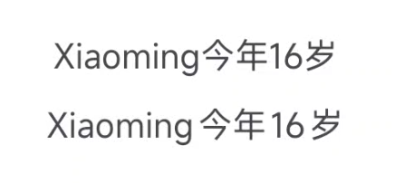

# Pangu Text

[](https://github.com/BetterAndroid/android-app-template/blob/main/LICENSE)
[](https://t.me/BetterAndroid)
[](https://t.me/HighCapable_Dev)
[](https://qm.qq.com/cgi-bin/qm/qr?k=Pnsc5RY6N2mBKFjOLPiYldbAbprAU3V7&jump_from=webapi&authKey=X5EsOVzLXt1dRunge8ryTxDRrh9/IiW1Pua75eDLh9RE3KXE+bwXIYF5cWri/9lf)


A typographic solution for the optimal alignment of CJK characters, English words, and half-width digits.

English | [简体中文](README-zh-CN.md)

|  | [BetterAndroid](https://github.com/BetterAndroid) |
|---------------------------------------------------------------------------------------------------------------------------------|---------------------------------------------------|

This project belongs to the above-mentioned organization, **click the link above to follow this organization** and discover more good projects.

## Project Reason

This project was created because, until now, there hasn’t been a public solution to perfectly address the typography issues between Chinese, Japanese,
Korean, and English.
Typically, when mixing CJK (i.e. Chinese, Japanese, Korean) with English, aesthetic issues can arise—a historical legacy stemming from the differences
in writing conventions between full-width and half-width characters. Although the W3C has now established CJK typography guidelines, only a few
individuals or companies willing to adhere to these standards have adopted this approach.

Currently, the known vendor solutions are as follows:

- Apple platforms (iOS, iPadOS, macOS, tvOS, watchOS) text typography solutions
- Xiaomi’s (HyperOS) text typography optimization
- OrginOS’s font-based text typography optimization

However, these solutions are closed and cannot be implemented on other platforms.
We aim to provide an open-source solution adaptable to various scenarios, featuring low intrusiveness and easy integration, allowing more developers
to effectively address text typography issues.

The primary inspiration for this project comes from [pangu.js](https://github.com/vinta/pangu.js), which offers a set of regular expressions for CJK
typography.
We have optimized these solutions to format text across platforms without inserting extra space characters. We extend this approach further to explore
additional possibilities.

Heartfelt thanks to the original developer of **pangu.js** for providing the foundational solution.

## Effects

As you can see, the typography scheme of `PanguText` does not work by simply inserting spaces between CJK characters and English words.
Instead, it leverages each platform's native handling to automatically add whitespace between these characters, ensuring minimal intrusion.

> Before Applying (Top) vs. After Applying (Bottom)



> Dynamic Application


`PanguText` supports dynamic application, which means it can add whitespace gaps to each character on-the-fly as you input text.

## Get Started

[Click here](https://betterandroid.github.io/PanguText/en) go to the documentation page for more detailed tutorials and content.

## Promotion

<!--suppress HtmlDeprecatedAttribute -->
<div align="center">
     <h2>Hey, please stay! 👋</h2>
     <h3>Here are related projects such as Android development tools, UI design, Gradle plugins, Xposed Modules and practical software. </h3>
     <h3>If the project below can help you, please give me a star! </h3>
     <h3>All projects are free, open source, and follow the corresponding open source license agreement. </h3>
     <h1><a href="https://github.com/fankes/fankes/blob/main/project-promote/README.md">→ To see more about my projects, please click here ←</a></h1>
</div>

## Star History


## License

- [Apache-2.0](https://www.apache.org/licenses/LICENSE-2.0)

```
Apache License Version 2.0

Copyright (C) 2019 HighCapable

Licensed under the Apache License, Version 2.0 (the "License");
you may not use this file except in compliance with the License.
You may obtain a copy of the License at

    https://www.apache.org/licenses/LICENSE-2.0

Unless required by applicable law or agreed to in writing, software
distributed under the License is distributed on an "AS IS" BASIS,
WITHOUT WARRANTIES OR CONDITIONS OF ANY KIND, either express or implied.
See the License for the specific language governing permissions and
limitations under the License.
```

Copyright © 2019 HighCapable